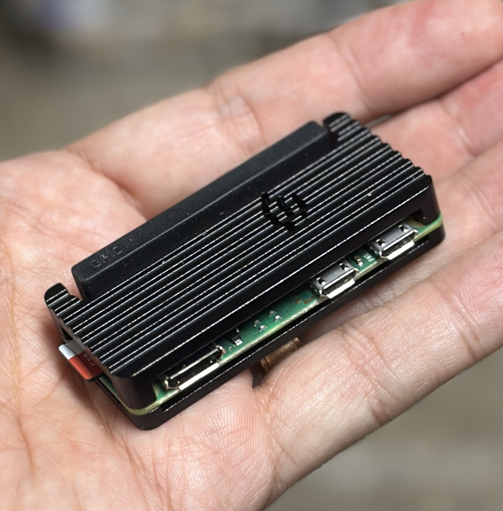
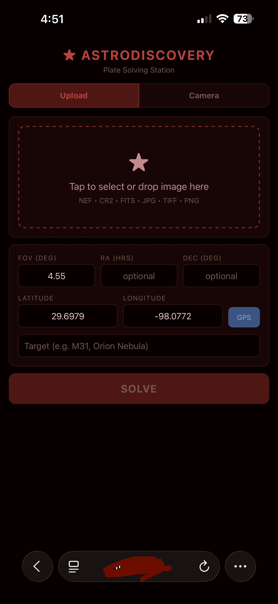

# A Brief Overview of Projects In The CodeSchnitzel Lab #

Updated 4/8/2026

[toc]

------

## Active Projects

### <u>AI Lab Automation Suite (aka JARVIS)</u>

(/lab-automation) -- An AI driven laboratory instrument test orchestration suite.  JARVIS constructs and administers complex test and experimental procedures based on natural language requests.  It considers the capabilities & limitations of lab instrumentation, follows safety guidelines and gathers & analyzes data.  JARVIS combines local AI with cloud-based AI.

For its first test to ensure it could communicate with instruments, it self-discovered a real problem with a power supply.  JARVIS brought this to my attention and worked through problem identification.   It turned out to be a faulty switch external to the unit.

- Status:
  - Phase 1 complete
  - Phase 2 planning

#### *SPaaS (Speech As A Service)*

JARVIS and other machines around my network now share centralized on-premise GPU-based Text-To-Speech and Speech-To-Text.  Heavy lifting happens on my WOPR machine (local AI) and audio is pipelined to and from my Windows desktop machine via a compiled service because that's where the best audio hardware is.  Any machine that can call an API can use the service.  JARVIS has his own unique voice and other devices around the lab have distinct voices as well.

- Status:
  - Done!  Up and running for internal devices including iPhone.
  - Planning accessibility to internal AI tools over the internet via VPN

- Keeping this listed under "Active Projects" because it's a sub-project to JARVIS.

### [Astro Discovery / Star Finder](#https://github.com/CodeSchnitzel/astro-discovery)

(/astro-discovery) -- Started as a portable VM for running plate solver software in the field to analyze an astrophotography photos and determine, based on stored star maps, what the point of aim, orientation and field of view are.  The project morphed into a Raspberry Pi Zero 2W appliance that can optionally connect directly to the camera and present a user interface through a WiFi connected phone.  It calculates point-of-aim error magnitude and direction to speed up accurate aiming.

Concept to working device in about 3 hours.

This project will later be incorporated into the [STAR TRKR](#STAR TRKR) project, but it is currently autonomous and presents its UI via a web browser on a cell phone or tablet.

- Status:	Complete / awaiting field testing if we ever have clear skies again
  - 
  - 

### <u>Atomic Director</u>

(/atomic-director) -- A stack of custom and commercial hardware and software for managing a stack of high precision time and GNSS-disciplined frequency standards.

- Status:
  - Equipment rack built
  - Controller computer, touchscreen & rack unit built; now converting from 2D to 3D CAD for continuing development
  	- 
  - Protocol Translator designed, firmware is unit-tested -- awaiting in-circuit testing
  - Comms system in engineering stage; PCB designed, prepping for production
  - 
  	- 
  - Switching & Signals systems in scoping
  - Power Control & Monitoring in scoping

### <u>Infrastructure Build Out Project</u>
(/infrastructure) -- This is an ever-evolving project to build network services, VM's, LXC containers and physical devices to facilitate all development & lab activities.
- Services deployed:
     - Internal reverse proxy and certificate authority (Nginx)
     - Data management stack (SQL Server, Prometheus, InfluxDB)
     - Data collection & analytics (Mosquitto, Grafana, etc.)
     - Artificial intelligence (Ollama, Jarvis, IEEE-488 networking tools, etc.)
     - Speech As A Service
- Status:	Permanent / Ongoing

### <u>Mellanox NIC Active Cooler</u>

(/mellanox-cooler) -- A hardware enhancement for Mellanox MCX4121 NIC cards to prevent them from self destructing due to their pathetically inadequate thermal design.

- Status:	Design complete / Implementation phase

### <u>STAR TRKR</u>

(/star-trkr) A collection of sub-projects that combine into a hardware and software package for astrophotography.  Named for the command reference silk-screened onto the guidance & navigation control panel in the Apollo Command Module and Lunar Module.

#### *Star Brain*

(/star-trkr/star-brain)  -- The computer and software that control STAR TRKR and interface with various hardware components.

- Status:
  - Camera platform built
    - Leveling and azimuth stage built (not motorized yet)
    - Elevation stage built & motorized
    - Right ascension stage and camera mounts built
  - Software requirements gathering
  - Motor drives / hardware controller in scoping
  - Polar alignment fixture in design

#### *Star Finder*

(/star-trkr/star-finder) -- An integration of the [Astro Discovery](#Astro Discovery) project into [Star Brain](#Star Brain) to merge plate solving and eventually polar alignment into the overall platform control.

#### *Tracker Muscle*

(/star-trkr/trkr-muscle) -- A high precision linear actuator to control STAR TRKR's right ascension axis, matching the angular rotation of the Earth to keep camera equipment fixed on a single aimpoint.

- Status:
  - Kinematics built
  - Calibration/alignment fixture built
  - Controller prototyped, awaiting round 2 engineering and software integration
  - Was used successfully for the April 8, 2024 total solar eclipse.

  	- 

### <u>ThermaLog</u>

A high precision, high accuracy logger that monitors multiple platinum wire temperature sensors as well as ambient environment conditions.  ThermaLog emphasizes oversampling and precisely time-correlated measurements for both real time and offline analysis.

- Status:
  - Fully prototyped & tested
  - Pre-production validation (not public yet)

### <u>VetteDirectional</u>

(/VetteDirectional) -- Implementation of a circuit devised by George to permit usage of LED marker and turn signal bulbs in old GM vehicles.

- Status:	Pre-production validation

### 

------

## Completed Projects ## 

### <u>Chrono Tester</u>

(/speeding-bullet) -- A quick & dirty project to test an Oehler 35P optical chronograph by simulating the photodiodes with optocouplers and a microcontroller.

- Status:	Complete

### [Photo Deduplicator](#https://github.com/CodeSchnitzel/Photo-Dedupe)

(/photo-dedupe) -- A GoLang program for identifying duplicates among a large collection of photos, regardless of orientation or resolution, using perceptual fingerprinting.  Includes a facility to allow easy confirmation and resolution.

- Status:	Complete.  Processed >200,000 photos in the first run.

### <u>Voice Scribe</u>

(/voice-scribe) -- Uses local AI to transcribe voice recorder files into text and then categorize them.  Transcription implemented very successfully on ~250 voice files.  Encountered GPU thermal issues that were resolved via software by taking fan control over from the GPU's driver.

- Status:	Complete

### <u>WOPR Local AI</u>

A powerful VM with dedicated GPU hardware (PCIe passthrough from the VM host) running Ollama and local LLM / inference models.  Runs Docker to augment speech and other related services.

- Status:	Complete

### 

------

## Queued Projects ## 

### 3-Channel Optical Chronograph ###

(/chrono-3chan) -- A modernized version of an Oehler model 35P chronograph with wireless feature for better data management and analysis.

- Status:	Scoping

### 7-Segment LED Display ###

(/displays/led7seg-driver) -- A simple, expandable multi-line LED display.  Complements the [RPN Calculator](#RPN Calculator) project.

- Status:	Feasibility tested

### Acoustic Trilaterator ###

(/acoustic-trilaterator) -- Microphone array for pinpointing bullet location on a target by signal analysis of the shockwave's acoustic signature and time difference of arrival.

- Status:	Scoping

### Barbara Mandrel ###

(/mandrel-4humanity) -- A 3D design and engineering project to save humanity and all its dependencies.  (NOT Barbara Mandrell, who is a 3D person)

- Status:	Conceptual

### Bobcat 225G Engine Idler ###

(/bobcat-idler) -- A modern replacement for an automatic idle-down circuit for the engine on Miller Bobcat 225G welder/generators.  This is to replace a part that is now unobtanium.

- Status:	Experimental / awaiting redesign

### Discerning Camera ###

(/insightful-observer) -- An edge AI camera that observes everything but only reports what is significant.

- Status:	Hardware acquired / feasibility study complete / awaiting prioritization

### EZ Clock ###

(/easy-clock) -- Inexpensive, hassle-free clocks that can be placed anywhere within range of a WiFi network with NTP access.  Modular for a choice of displays including round TFT's that show traditional clock/watch faces, 7-segment displays, Burroughs Panaplex displays and even speech synthesis.  Benefits from the [7-Segment LED Display](#7-Segment LED Display) project and [Panaplex Plasma Display Driver](#Panaplex Plasma Display Driver) project.

- Status:	Awaiting prioritization (prototyping / POC is done)

### Gauss B Gone ###

(/degauss-parts) A device that properly degausses small parts according to scientific principles rather than how cheaply can it be made.

- Status:	Awaiting prioritization

### Keithley SCAN2000 Card Clone ###

(/scan2k-clone) -- This is an implementation of a third-party project by "[cozdas](https://github.com/cozdas/CozScan2020)" to replicate a Keithley SCAN2000 20-channel data acquisition scanner but with SSR's instead of mechanical relays.

- Status:	Awaiting prioritization

### Laboratory Clock Generator ###

(/clock-gen) -- A lab device for producing pulse trains over a wide range of user defined frequencies, based on an Si5354 frequency synthesizer chip.  A central feature is a friendly user interface and extended feature set that are substantially different than other Si5354 projects.

- Status:	Awaiting version 2 reengineering

### Laboratory DC UPS ###

(/dc-ups) -- A high efficiency intelligent lithium batter based UPS for powering lab equipment that runs on DC power.

- Status:	Scoping

### Line Of Sight Calculator ###

(/splat-los) -- A tool for calculating line of sight on the surface of the Earth from any altitude based on radar terrain elevation data collected by Space Shuttle Endeavor, STS-99 on the Shuttle Radar Topography Mission (SRTM) in February 2000.

Useful for estimating terrestrial radio coverage.  Inspired by tools published by Green Bay Professional Packet Radio.

- Status:	Data gathered / awaiting prioritization

### Mains Monitor ###

(/mains-monitor) -- Lab instrument for characterizing power line frequency drift, voltage consistency and long term accuracy.

- Status:	Scoping

### OCXO Calibrator ###

(/ocxo-cal) -- An automated lab instrument for trimming free-running OCXO oscillators to serve as portable time standards for independent data acquisition devices that need to take time-coherent measurements.

- Status:	Scoping

### Panaplex Plasma Display Driver ###

(/displays/panaplex-driver) -- A modernized circuit to drive early 1970's Burroughs Panaplex displays.  To be used in conjunction with other projects such as [RPN Calculator](#RPN Calculator) and [EZ Clock](#EZ Clock).

- Status:	Data gathering

### PC Cooler Override

(/cooler-override) -- Interposer device to allow a PC motherboard to control PC fans as normal, but to intervene and increase RPM when motherboard controls fail to manage thermal conditions.

- Status:	Requirements gathering

### Quantum Keygen ###

(/quantum-keygen) -- A high entropy cryptography key generator based on radioactive decay and other sources of true entropy.

- Status:	Feasibility study

### Retro Crypto ###

(/retry-crypto) -- An anachronistic cryptography device based on a massive array of obsolete Intel 8294A 56-bit DES encryption chips.

- Status:	Hardware acquired / awaiting prioritization

### RPN Calculator ###

(/rpn-calculator) -- A Reverse Polish Notation calculator that is both imminently practical and amusingly anachronistic, utilizing math libraries from CERN and offering extreme modularity of keyboard inputs, display options and API access.  Combines the best of all classic HP calculators throughout history.

- Status:	Scoping / awaiting prerequisites

### TEC Controller ###

(/tec-controller) -- Hardware and software to drive thermoelectric (Peltier) devices to control temperature in a test chamber using PID loops.

- Status:	Scoping

### Telephone Ring Generator ###

(/ring-generator) -- A circuit to ring a classic Western Electric telephone bell from a low voltage lithium battery.  A prerequisite to turn a rotary dial phone into a Bluetooth terminal.

- Status:	Scoping

### Visual Parts Database ###

(/visual-database) -- A web-based interactive lookup tool for finding information about parts on an assembly drawings.

- Status:	Data gathered / awaiting prioritization

### YIG Oscillator Driver ###

(/yig-driver) -- Experimental circuits to learn fine control of Advantek and Hewlett Packard YIG oscillators.

- Status:	Scoping